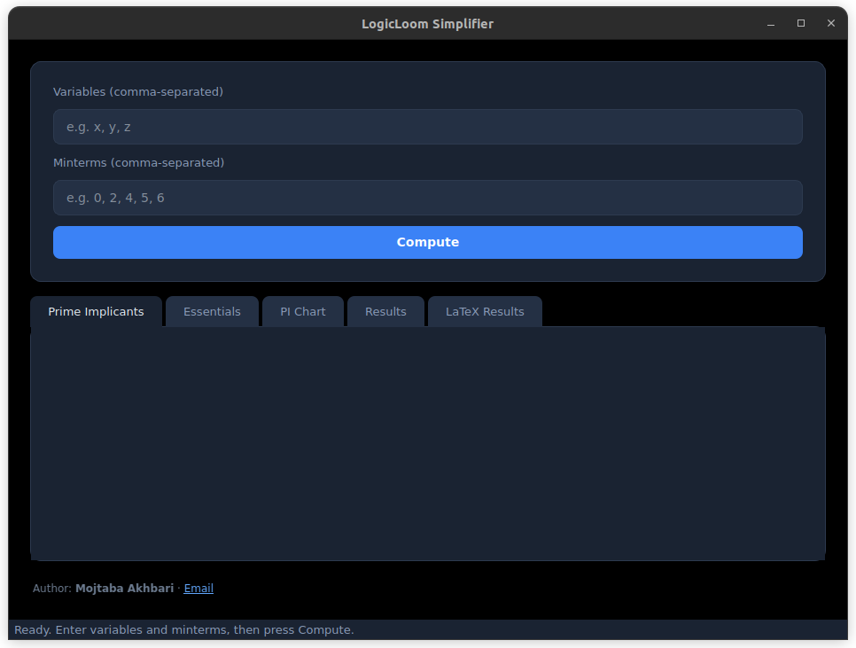
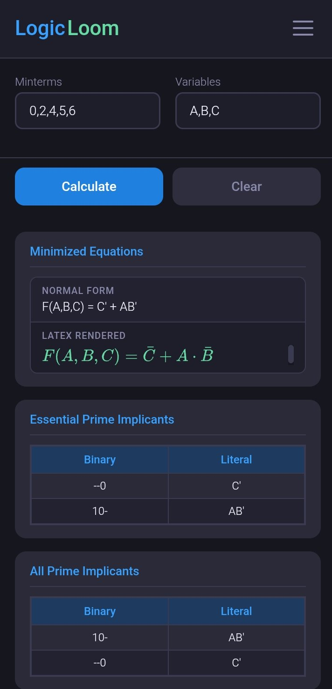

# LogicLoom

[](https://www.python.org/)
[](https://www.riverbankcomputing.com/software/pyqt/)
[](https://opensource.org/licenses/MIT)

**LogicLoom** is a single-repository project for minimizing boolean expressions. It consists of **logicloom_core** (the engine and CLI) and **logicloom_ui** (an open-source desktop GUI that uses the core). The UI is built only for this project and is part of the same repo.

### Desktop GUI



### 📱 Android App



---

## Features

**Core**

- Minimal boolean expression output in string or LaTeX format
- Prime implicant chart data and terminal display
- Simple CLI with demo mode for quick checks

**Desktop UI**

- Variables and minterms input with live validation
- Prime implicants table (binary and literal forms)
- Essential prime implicants and PI chart
- Results as minimal SOP form
- LaTeX results tab with MathJax

**Android App** 📱

- 🎯 Native Android experience with intuitive touch interface
- 📝 Easy input for variables and minterms with mobile-friendly keyboard
- 📊 Interactive prime implicants table optimized for mobile screens
- 📱 Swipe between different result tabs (PI Chart, Results, LaTeX)
- 🔍 Zoom and scroll support for complex expressions
- 📋 One-tap copy to clipboard for results
- 🌙 Dark/Light theme support (system default)

---

## Project layout

```
LogicLoom/
├── README.md
├── requirements.txt
├── apps/
│   └── logicloom.apk        # 📱 Pre-built Android app
├── js/
│   └── tex-mml-chtml.js      # MathJax for LaTeX in the UI
├── shots/
│   ├── screenshot.png        # Desktop GUI screenshot
│   └── android.jpg           # Android app screenshot
├── logicloom_core/           # Core engine and CLI
│   ├── pyproject.toml
│   └── logicloom/
└── logicloom_ui/            # Desktop GUI (open source, uses logicloom_core)
    ├── app.py
    ├── icon.ico              # Application icon
    ├── main_window.py
    ├── html_templates.py
    ├── validation.py
    ├── workers.py
    └── ...
```

---

## Requirements

- **Python 3.10+**
- **PyQt6** (only for the desktop GUI; CLI works without it)

---

## Install and run

From the **repository root** (so `js/` and both packages are available):

```bash
git clone https://github.com/mojtabaakhbari/LogicLoom.git
cd LogicLoom

python -m venv .venv
source .venv/bin/activate   # Windows: .venv\Scripts\activate

pip install -r requirements.txt
pip install -e logicloom_core
```

**CLI**

```bash
logicloom --vars "A,B,C" --minterms "0,2,3,5" --output both
logicloom --demo --pichart terminal
```

**GUI**

```bash
python -m logicloom_ui
```

**Android App** 📱

🎉 **Quick Start - Ready to Use!**

1. 📥 Download the pre-built APK: [apps/logicloom.apk](apps/logicloom.apk)
2. 📲 Install on your Android device (enable "Unknown Sources" in settings)
3. 🚀 Launch LogicLoom and start simplifying boolean expressions!

📋 **Android Requirements**

- Android 5.0 (API level 21) or higher
- ~50MB storage space
- No additional dependencies required

Or with `PYTHONPATH` instead of installing the core:

```bash
pip install -r requirements.txt
PYTHONPATH=. python -m logicloom_ui
```

---

## Usage

**CLI**

| Argument       | Short | Description                                                                   |
| -------------- | ----- | ----------------------------------------------------------------------------- |
| `--vars`       | `-v`  | Comma-separated variable names (e.g. `A,B,C`).                                |
| `--minterms`   | `-m`  | Comma-separated minterm numbers (e.g. `0,1,2,5`).                             |
| `--output`     | —     | Output format: `string`, `latex`, or `both` (default: `string`).              |
| `--all`        | —     | Print all minimal covers (not just the first).                                |
| `--pichart`    | —     | Print prime implicant chart: `terminal` or `latex`.                           |
| `--pitable`    | —     | Print prime implicants table (binary and literal form): `terminal`.           |
| `--essentials` | —     | Print essential prime implicants table (binary and literal form): `terminal`. |
| `--demo`       | —     | Run bundled demo problems (no `--vars`/`--minterms` needed).                  |
| `--version`    | —     | Print version and exit.                                                       |

Example: `logicloom -v "x,y,z" -m "0,2,4,5,6" --output both --all --pitable terminal --essentials terminal --pichart terminal`

**GUI**

1. **Variables** — e.g. `A, B, C` or `x, y, z`
2. **Minterms** — e.g. `0, 2, 4, 5, 6`
3. Click **Compute** and use the **Prime Implicants**, **Essentials**, **PI Chart**, **Results**, and **LaTeX Results** tabs.

---

## Python API (core)

### Setup

```python
from logicloom import LogicGateSimplifier, Term, PIChartData, PIChartRow

# From comma-separated strings (e.g. CLI-style)
simplifier = LogicGateSimplifier.from_strings("x,y,z", "0,2,4,5,6")

# Or from lists
simplifier = LogicGateSimplifier(minterms=[0, 2, 4, 5, 6], variables=["x", "y", "z"])

simplifier.simplify()  # run minimization (required before get_* methods)
```

**Constructor / factory arguments**

| Call                                                            | Arguments                                         | Description                                                |
| --------------------------------------------------------------- | ------------------------------------------------- | ---------------------------------------------------------- |
| `LogicGateSimplifier(minterms, variables)`                      | `minterms`: `list[int]`, `variables`: `list[str]` | Build from lists of minterm indices and variable names.    |
| `LogicGateSimplifier.from_strings(variables_str, minterms_str)` | `variables_str`: `str`, `minterms_str`: `str`     | Parse comma-separated strings (e.g. `"A,B,C"`, `"0,2,5"`). |

### Chart data (PI chart)

Get structured data for the prime implicant chart (minterms × prime implicants, with a boolean matrix):

```python
data = simplifier.get_pichart_data()
# data: PIChartData with:
#   - minterm_numbers: list[int | None]   — minterm indices
#   - prime_implicants: list[str]         — binary forms (e.g. "01-", "1-0")
#   - matrix: list[list[bool]]            — matrix[i][j] = PI j covers minterm i

# Pre-rendered chart strings (optional tick character for “covered” cells)
latex_table = simplifier.get_pichart_latex(tick=r"$\checkmark$")   # default LaTeX checkmark
terminal_table = simplifier.get_pichart_terminal(tick="x")         # default "x"
```

**Chart method arguments**

| Method                 | Argument | Type  | Default           | Description                                                 |
| ---------------------- | -------- | ----- | ----------------- | ----------------------------------------------------------- |
| `get_pichart_latex`    | `tick`   | `str` | `r"$\checkmark$"` | String used in LaTeX for each covered (minterm, PI) cell.   |
| `get_pichart_terminal` | `tick`   | `str` | `"x"`             | Character used in the terminal table for each covered cell. |

### Prime implicants and essentials tables (terminal)

Print tables of prime implicants or essential prime implicants (binary form and literal form) in a box-drawing terminal layout:

```python
# Prime implicants table (Binary | Literal)
pi_table = simplifier.get_prime_implicants_terminal()
print(pi_table)

# Essential prime implicants table (Binary | Literal)
ess_table = simplifier.get_essentials_terminal()
print(ess_table)
```

CLI: use `--pitable terminal` and/or `--essentials terminal`.

### Equations (minimal SOP)

Get all minimal sum-of-products equations (string and LaTeX):

```python
equations = simplifier.get_all_equations()
# list of dicts: [{"string": "F(x,y,z) = ...", "latex": "F(x,y,z) = ..."}, ...]
for eq in equations:
    print(eq["string"])
    print(eq["latex"])

# Single minimal cover as LaTeX only
latex_eq = simplifier.get_equation_latex()
```

### Other public methods and attributes

| Method / attribute                | Arguments                         | Description                                                                                 |
| --------------------------------- | --------------------------------- | ------------------------------------------------------------------------------------------- |
| `simplify()`                      | —                                 | Runs minimization; returns the first minimal cover as `list[Term]`.                         |
| `get_all_minimal_covers()`        | —                                 | Returns all minimal covers, each as `list[Term]`.                                           |
| `get_all_equations()`             | —                                 | Returns all minimal equations as `list[dict]` with `"string"` and `"latex"` keys.           |
| `get_equation_latex()`            | —                                 | Returns the first minimal equation as a single LaTeX string.                                |
| `get_pichart_data()`              | —                                 | Returns `PIChartData` (minterm_numbers, prime_implicants, matrix).                          |
| `get_pichart_latex(...)`          | `tick`: `str` = `r"$\checkmark$"` | Returns the PI chart as a LaTeX tabular string; `tick` is the mark for covered cells.       |
| `get_pichart_terminal(...)`       | `tick`: `str` = `"x"`             | Returns the PI chart as a plain-text table; `tick` is the character for covered cells.      |
| `get_prime_implicants_terminal()` | —                                 | Returns prime implicants table (Binary and Literal columns) as a terminal string.           |
| `get_essentials_terminal()`       | —                                 | Returns essential prime implicants table (Binary and Literal columns) as a terminal string. |
| `variables`                       | —                                 | `list[str]` — variable names.                                                               |
| `main_minterms`                   | —                                 | `list[Term]` — input minterms.                                                              |
| `prime_implicants`                | —                                 | `set[Term]` — all prime implicants.                                                         |
| `essentials`                      | —                                 | `list[Term]` — essential prime implicants.                                                  |
| `pichart`                         | —                                 | `list[PIChartRow]` — chart rows (minterm, prime_implicants, is_remaining).                  |

All `get_*` methods call `simplify()` internally if it has not been run yet.

### Types

- **`Term`** — Binary form (e.g. `"01-"`), optional number; `.to_normal_expression(vars)`, `.to_latex_expression(vars)`.
- **`PIChartData`** — Dataclass: `minterm_numbers`, `prime_implicants`, `matrix`.
- **`PIChartRow`** — Dataclass: `minterm`, `prime_implicants`, `is_remaining`.

---

## Author

**Mojtaba Akhbari**  
Email: [mojtabaakhbari.cs@gmail.com](mailto:mojtabaakhbari.cs@gmail.com)

---

## License

MIT.
